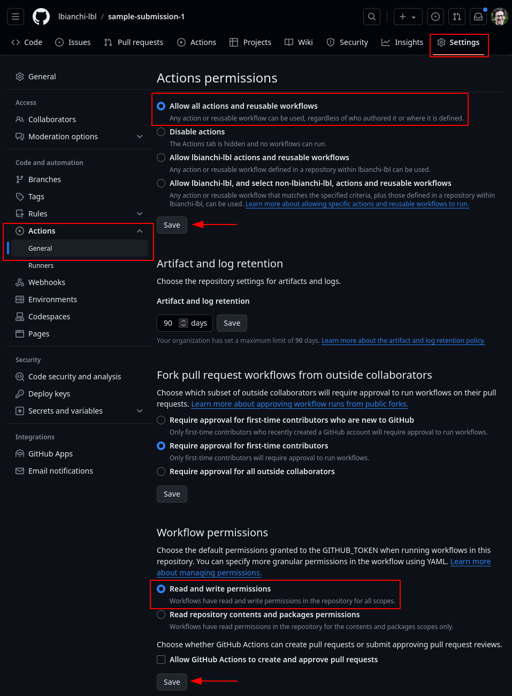

# Getting started

## Step 1: enabling GitHub Actions in your repository

Depending on how your repository is configured, the Actions functionality might need to be enabled first, along with the permissions needed by the workflow to perform certain steps.

1. Navigate to the `Settings` tab of your repository, then select the `Actions` section from the menu on the left-hand side
2. Select the options highlighted in red in the figure below, making sure of confirming each selection by clicking on the corresponding `Save` buttons



## Step 2: adding the workflow definition file

GitHub Actions workflows are defined by files in the `.github/workflows` directory using the YAML format. A workflow definition file contains two key components:

- The `on` section, specifying one or more triggers, i.e. the conditions under which the workflow will be run
- The `jobs` section, specifying one or more jobs, i.e. the tasks that will be executed during each workflow runs

In this case, our workflow (the _caller workflow_) will contain a single job referencing the workflow `check-submission.yml` defined in this (i.e.`USRSE/notebooks-submissions`) repository (the _called workflow_).

1. From a local clone of your repository, or alternatively using the GitHub web interface, create a subdirectory named `.github/workflows`
2. Inside `.github/workflows`, create a file with any name and the `.yml` extension, e.g. `.github/workflows/checks.yml`, containing the following snippet:
  
  ```yml
  name: Check submission for USRSE'25

  on:
    push:  # `on.push` means that the workflow will be triggered any time one or more commits are pushed to the repository

  jobs:
    check-submission:  # `check-submission` is the job-id and can be chosen arbitrarily
      uses: USRSE/notebooks-submissions/.github/workflows/check-submission.yml@v1
      with:
        notebook: my-sample-notebook.qmd  # replace my-sample-notebook.qmd with the actual path to your notebook
  ```

3. Change the value of the `jobs.<job-id>.with.notebook:` input field to match the actual path to your notebook, then save the `.github/workflows/check.yml` file and stage, commit, and push the changes using Git (if editing locally); or follow the prompts and create a commit directly to the current branch (if using the GitHub web interface)
4. Navigate to the `Actions` tab of your GitHub repository. If everything is configured correctly, after a few moments, you should see a workflow run corresponding to your latest pushed commits
5. Click on that workflow run to switch to the Run summary page, where the overall status, in-progress and completed jobs, and ultimately the outcome of the various parts of the workflow are displayed.

## Step 3: configuring your repository

- After verifying that the workflow is running as expected, it's likely that you'll need to configure the repository with the _auxiliary files_ needed to set up the computational environment where the notebook will be run
- The exact list of files will depend on the specific programming language (Python, R, ...), file format (`.qmd`, `.ipynb`, `.Rmd`, ...), external dependencies, etc needed to run your notebook
- To help you choose which files should be added to your repository based on your notebook's needs, refer to the following resources:
  - The [`usrse-notebooks-sample-submission` topic on GitHub](https://github.com/topics/usrse-notebooks-sample-submission) collects a set of repositories showcasing some of the possible configurations
  - The [_Configuring your repository_ section of the repo2docker documentation](https://repo2docker.readthedocs.io/en/latest/configuration/index.html) contains a comprehensive list of files supported by the USRSE'25 notebooks CI workflow build infrastructure, which (similarly to mybinder.org) is based on the versatile `repo2docker` tool
